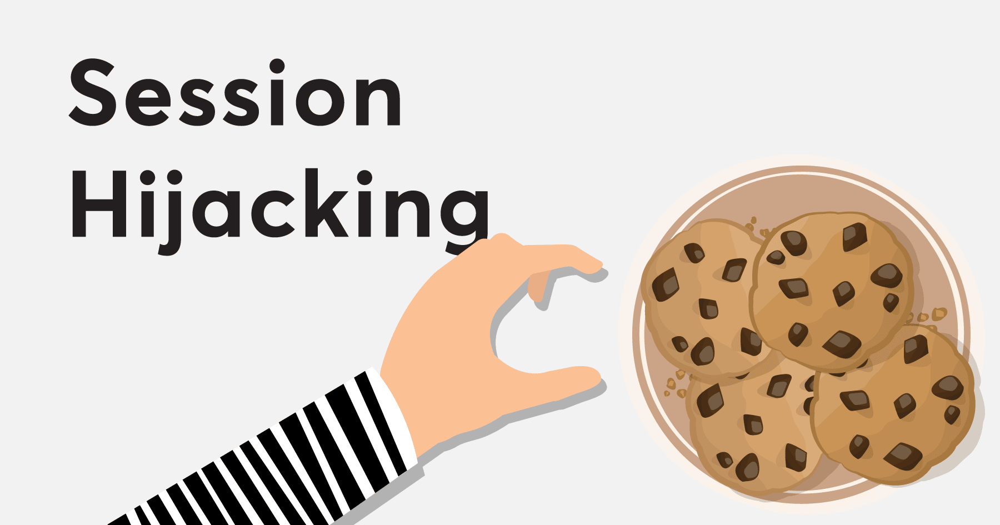

# PHP Cookie Stealer

This project is a simple PHP script used to demonstrate how an attacker can steal cookies. It captures the victim's cookie, IP address, user agent, and geographical details, and then logs this information.

## WARNING

This script is for educational and demonstration purposes only. Improper use of this code may violate privacy laws and terms of service. Use at your own risk.

## Prerequisites

- PHP 8.x or higher
- An HTTP server like Apache or Nginx

## Setup

1. Clone the repository to your server directory.

2. Make sure your server is properly configured to execute PHP scripts.

3. Open your browser and navigate to the location of the PHP file on your server.

## Code Explanation

The code works by receiving a `cookie` parameter via a GET request. It then captures various information about the request and the server, and logs this information to a file named `Log.txt`.

The information captured includes:

- Victim's Cookie
- Victim's IP
- HTTP Referer
- User Agent
- Server Name
- Server IP
- User's country, region, and city (based on IP)

Please note that this script does not sanitize or validate input in order to fully demonstrate the potential dangers of cookie stealing attacks. Always validate and sanitize your inputs in real-world applications.

## Usage

The script can be executed by sending a GET request to the script location with a `cookie` parameter. For example:

http://your-server/cookie-stealer.php?cookie=test

This would result in the script capturing the information and logging it to `Log.txt`.

## License

This project is licensed under the MIT License - see the LICENSE.md file for details.
